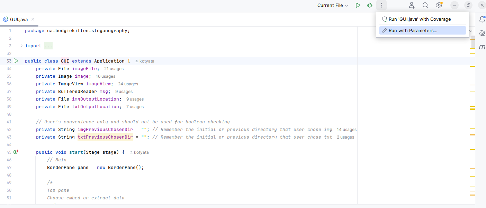
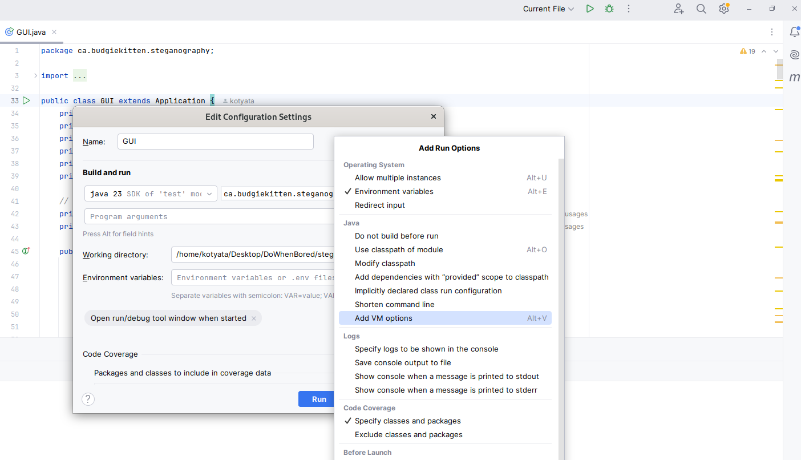
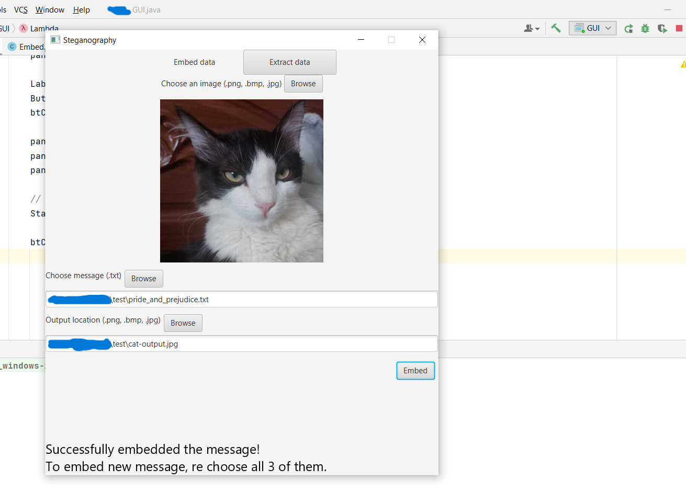
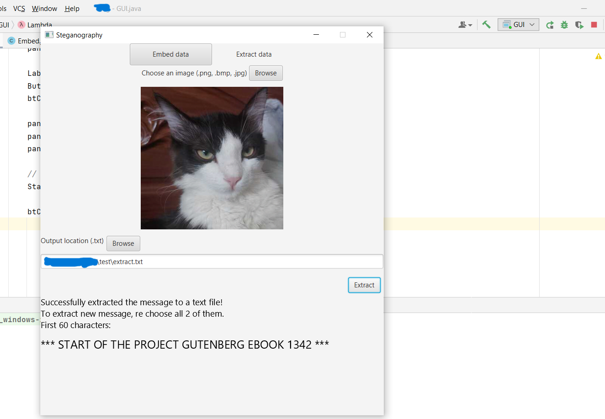

## Detailed explanation: https://budgiekitten.ca/project/large/2yav/steganography/

---

## Introduction

---

Steganography is the study of concealing (hiding) messages or data in an image, without it being detected. Not to confuse with watermarking which usually carries supplemental information and is often advertised to deter illegal activity.

It is often difficult to distinguish whether an image contains the secret messages without the original image. This project will implement the simplest and most common steganography algorithm called [Least Significant Bit (LSB)](https://en.wikipedia.org/wiki/Bit_numbering#Bit_significance_and_indexing).

## Installation

---

### Note: Sadly there is some problems with java.awt and javax on Linux so the application won't work well on Linux

### Build from source (for Windows)
1. Install [JavaFX](https://gluonhq.com/products/javafx/). Remember to keep the paths for *VM options*
2. Download [IntelliJ IDEA Community Edition](https://www.jetbrains.com/idea/download/?section=windows)
3. Launch IntelliJ, choose *Clone repository* 
4. For the URL, paste in: ```https://github.com/BudgieKitten/steganography.git```
5. In order to run a JavaFX application, you will need to add a VM option. On the current GUI.java file, open the three dots next to the bug and choose run parameters 
6. Then choose *Modify options* and add *VM options* 
6. Paste the following code into your VM option (Remember to change path-to-javafx-you-downloaded-in-step-1): ```--module-path /path-to-javafx-you-downloaded-in-step-1/javafx-sdk-24.0.1/lib --add-modules javafx.controls,javafx.fxml```
7. Click Apply and Run
8. Enjoy!

## How to use

---
### Embed
You can input your image and a secret message, then output a file of your own choice.

##### Some notes
1. Currently, this project only supports *inputs* of .jpg, .jpeg, .bmp and .png. However, only .png is supported as *output* format because in the RGBA color range, only .png can take the value of Alpha
2. Currently, this project only supports UTF-8. Any foreign characters that don't belong to the ASCII table will be substituted as '?' character.



### Extract
This is where you will extract your secret from an image and output a text file of your choice.


## References
https://www.amazon.ca/Steganography-Digital-Media-Principles-Applications/dp/0521190193

## License
MIT License 2025

## Contact
budgiekitten@outlook.com